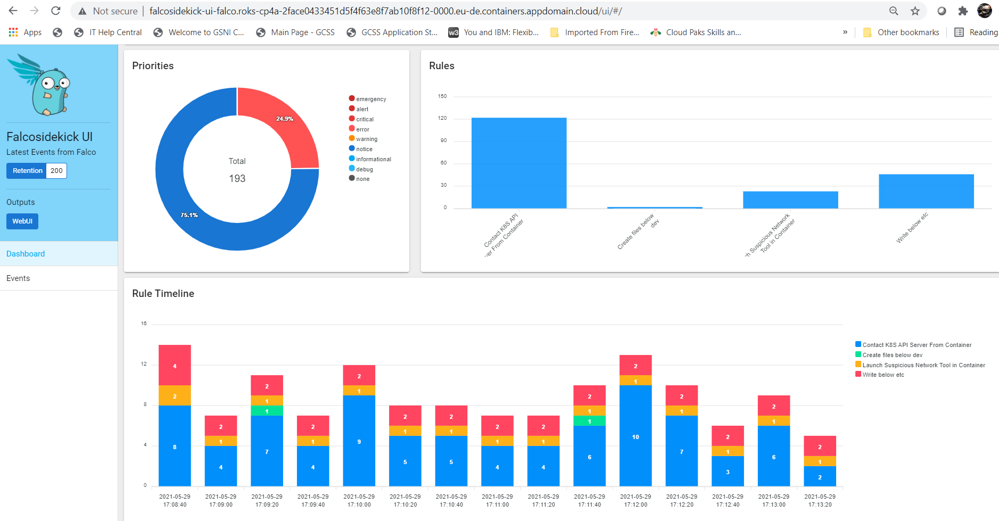
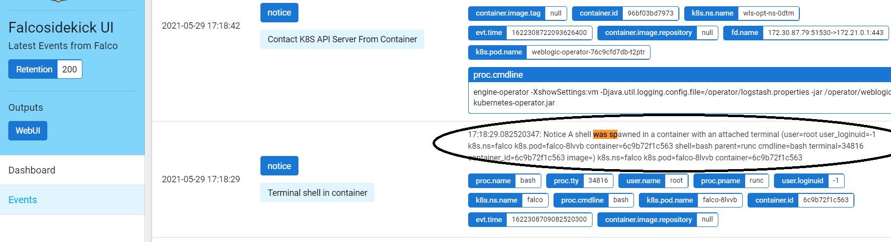
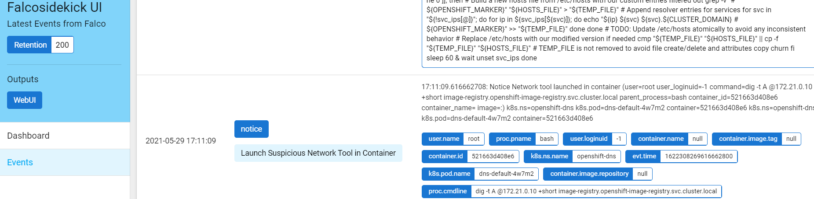
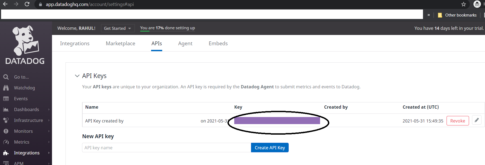
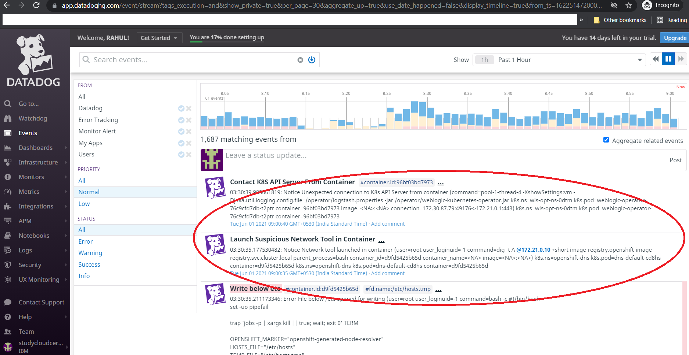
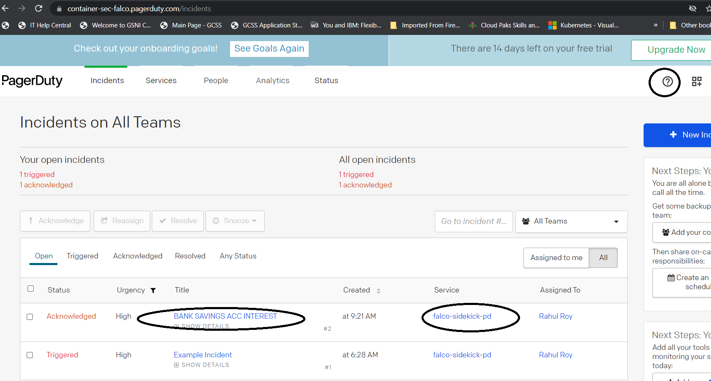
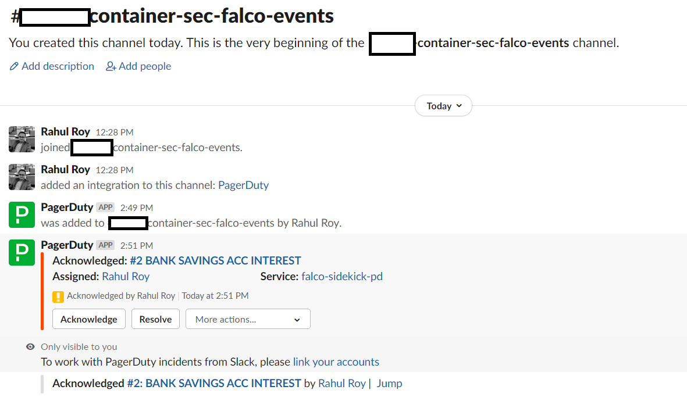

# Container runtime security monitoring with Falco and Redhat Openshift

## Why we need?

Containers running in production environments actively fulfill requests from the internet or internal microservices, and are the constant subject of scans, attacks, and data exfiltration attempts by malicious actors. Considering the dynamic nature of container environments – and many container, host, and network surfaces which may come under attack – best practices like vulnerability scanning and hardening attack surfaces are simply not enough to achieve the complete runtime protection now required.

## Falco as the tool

Falco is a cloud-native runtime security system that works with both containers and raw Linux hosts. It was developed by Sysdig and is an incubating project in the Cloud Native Computing Foundation. Falco works by looking at file changes, network activity, the process table, and other data for suspicious behavior and then sending alerts through a pluggable back end. It inspects events at the system call level of a host through a kernel module or an extended BPF probe. Falco contains a rich set of rules that you can edit for flagging specific abnormal behaviors and for creating allow lists for normal computer operations.

Falco as a tool has 3 components:
1. Falco - the core framework where policy rules are configured into
2. Falco Sidekick - a daemon that extends a number of possible outputs from Falco and respective integration
3. Falo Sidekick UI - a simple web UI where all those container security events are displayed in a dashboard.

While in this example, we are using Sidekick UI as the output, but looking at the available options for Sidekick, one can easily integrate from Slack, Pagerduty, Prometheus to any public cloud event sourcing resources like Azure Event Hub or AWS Lamda.

## View a Falco rule

Falco rules, which governs, how it will treat any activity in the container, is configured at:

`https://github.com/falcosecurity/charts/tree/master/falco/rules`

A sample rule like below watches for potentially nefarious Netcat commands and throws alerts when it sees them at the WARNING level.

```bash
$ cat rules/falco_rules.yaml | grep -A 12 'Netcat Remote'
- rule: Netcat Remote Code Execution in Container
  desc: Netcat Program runs inside container that allows remote code execution
  condition: >
    spawned_process and container and
    ((proc.name = "nc" and (proc.args contains "-e" or proc.args contains "-c")) or
     (proc.name = "ncat" and (proc.args contains "--sh-exec" or proc.args contains "--exec"))
    )
  output: >
    Netcat runs inside container that allows remote code execution (user=%user.name
    command=%proc.cmdline container_id=%container.id container_name=%container.name image=%container.image.repository:%container.image.tag)
  priority: WARNING
  tags: [network, process]
```

## Prerequisites

1. Redhat OC cluster and necessary access
2. Falco (https://github.com/falcosecurity/)

## Installation

### Step 1: Create a namespace in OCP cluster

- Sign in to the OCP cluster
- Create a new namespace 'falco' with `oc create namespace falco`
- Set the new project with `oc project falco`

### Step 2: Install Falco with Helm

- add the falcosecurity charts repository with 

```bash
>helm repo add falcosecurity https://falcosecurity.github.io/charts
>helm repo update
```

NOTE: One can also download the Falco repo locally and deploy using YAML. However with Helm, it's ensured that we take the latest available deployment options

- install Falco with Sidekick and Ui enabled

```bash
>helm install falco falcosecurity/falco --set falco.docker.enabled=false --set falco.jsonOutput=true --set falcosidekick.enabled=true --set falcosidekick.webui.enabled=true -n falco
```

The output will look like:

```bash
I0529 23:46:35.524178   15776 request.go:655] Throttling request took 1.1329738s, request: GET:https://c100-e.eu-de.containers.cloud.ibm.com:32592/apis/app.k8s.io/v1beta1?timeout=32s
NAME: falco
LAST DEPLOYED: Sat May 29 23:46:37 2021
NAMESPACE: falco
STATUS: deployed
REVISION: 1
NOTES:
Falco agents are spinning up on each node in your cluster. After a few
seconds, they are going to start monitoring your containers looking for
se>curity issues.

No further action should be required.
```

NOTE:
1. we have set `falco.docker.enabled=false` as OC uses `containerd`
2. we have set `falco.jsonOutput=true` for better output representation in the Faclo event logs
3. we are simulatenously installing Sidekick and Ui so both options are set to true at installation time

### Step 3: Verify in the OC cluster

#### First, lets check how many pods were created:

```bash
oc get pods
NAME                                      READY     STATUS    RESTARTS   AGE
falco-8lvvb                               1/1       Running   0          69m
falco-9v79g                               1/1       Running   0          69m
falco-falcosidekick-669dd7b9bf-crpgz      1/1       Running   0          69m
falco-falcosidekick-669dd7b9bf-l87fc      1/1       Running   0          69m
falco-falcosidekick-ui-7fd67f6bff-wg62f   1/1       Running   0          27m
falco-qxqgw                               1/1       Running   0          69m 
```
Based upon the Helm chart specification, we have:
- 3 pods for Falco
- 2 pods for Falco Sidekick
- 1 pod for Falco Sidekick-UI

### Verify Falco running as daemonset
Falco runs a daemonset for the falco daemon itself, ensuring a single copy of the program per physical node is running.
```bash
oc get ds
NAME      DESIRED   CURRENT   READY     UP-TO-DATE   AVAILABLE   NODE SELECTOR   AGE
falco     3         3         3         3            3           <none>          32h
```

#### ALERT!
In case you find all of the above are not created, then check the `Deployment` pane and check if you find an error like this:

- for Sidekick

```bash
pods "falco-falcosidekick-669dd7b9bf-" is forbidden: unable to validate against any security context constraint: [fsGroup: Invalid value: []int64{1234}: 1234 is not an allowed group spec.containers[0].securityContext.securityContext.runAsUser: Invalid value: 1234: must be in the ranges: [1001020000, 1001029999]]
```
- for Sidekick-UI

```bash
pods "falco-falcosidekick-ui-7fd67f6bff-" is forbidden: unable to validate against any security context constraint: [fsGroup: Invalid value: []int64{1234}: 1234 is not an allowed group spec.containers[0].securityContext.securityContext.runAsUser: Invalid value: 1234: must be in the ranges: [1001020000, 1001029999]]
```
This happens because in Openshift, the service accounts which get created during installation, should have OpenShift Security Context Constraints set as priviledged

#### Now we check how many service accounts were created.

```bash
>oc get serviceaccount
NAME                  SECRETS   AGE
builder               2         38m
default               2         38m
deployer              2         38m
falco                 2         37m
falco-falcosidekick   2         37m
pipeline              2         38m
```

So we will have to assign both service accounts `falco` and `falco-falcosidekick` as priviledged

```bash
  >oc adm policy add-scc-to-user privileged -z falco
scc "privileged" added to: ["system:serviceaccount:falco:falco"]

  >oc adm policy add-scc-to-user privileged -z falco-falcosidekick
scc "privileged" added to: ["system:serviceaccount:falco:falco-falcosidekick"]
```
With the above, we should see the errors for Falco-Sidekick in the `Deployment` pane resolve and respective pods for Falco-Sidekick should come up.

If we still see the same error in Falco-Sidekick-UI in the `Deployment` pane, then additionally we will have to set Security Context to the `default` service account under `Falco` namespace.

```bash
  >oc adm policy add-scc-to-user privileged -z default
scc "privileged" added to: ["system:serviceaccount:falco:default"]
```
Post this, we should see all the pods respective to Falco, Falco Sidekick and Falco Sidekick-UI come up.

#### Next we check how services were created

```bash
>oc get svc -n falco
NAME                     TYPE        CLUSTER-IP       EXTERNAL-IP   PORT(S)    AGE
falco-falcosidekick      ClusterIP   172.21.253.206   <none>        2801/TCP   70m
falco-falcosidekick-ui   ClusterIP   172.21.247.65    <none>        2802/TCP   35m  
```

Till this point, our setup is almost ready, except that we will need to expose the UI so that we can access publicly and also the sidekick svc so that we can test it (and later delete the sidekick route)

### Step 4: Create route for the services

First, we create a route for Sidekick to see if its able to pickup the events from Falco

```bash
>oc create route edge --service=falco-falcosidekick
route.route.openshift.io/falco-falcosidekick created

>oc get routes
NAME    HOST PORT      PATH      SERVICES                 PORT      TERMINATION   WILDCARD
falco-falcosidekick      falco-falcosidekick-falco.roks-cp4a-2face0433451d5f4f63e8f7ab10f8f12-0000.eu-de.containers.appdomain.cloud                falco-falcosidekick      http      edge          None
```
Next, we test the deployment of `Falcosidekick` with a simple browser test by pasting in the broswer URL:

```bash
https://falco-falcosidekick-falco.roks-cp4a-2face0433451d5f4f63e8f7ab10f8f12-0000.eu-de.containers.appdomain.cloud/ping

pong
```
We can safely delete this route now as we will not access Sidekick directly after this.

Next, we create a route for Sidekick-UI to see if its able to display the events from Falco & Sidekick

```bash
>oc create route edge --service=falco-falcosidekick-ui
route.route.openshift.io/falco-falcosidekick-ui created

>oc get routes
NAME    HOST PORT      PATH      SERVICES                 PORT      TERMINATION   WILDCARD
falco-falcosidekick      falco-falcosidekick-falco.roks-cp4a-2face0433451d5f4f63e8f7ab10f8f12-0000.eu-de.containers.appdomain.cloud                falco-falcosidekick      http      edge          None
falco-falcosidekick-ui   falco-falcosidekick-ui-falco.roks-cp4a-2face0433451d5f4f63e8f7ab10f8f12-0000.eu-de.containers.appdomain.cloud             falco-falcosidekick-ui   http      edge          None
```

Now if we open up this route URL in browser, we should be able to see the below web UI.

<p>
    
</p>


### Step 5: Real time test to see Falco at works

#### 1. Tail the logs in the first PS terminal

In one terminal, we tail the log in one pod of Falco

```bash
>oc logs -f falco-8lvvb
* Setting up /usr/src links from host
* Running falco-driver-loader with: driver=module, compile=yes, download=yes
* Unloading falco module, if present
* Trying to dkms install falco module

Kernel preparation unnecessary for this kernel.  Skipping...

Building module:
cleaning build area....
```

#### 2. Generate security event in the second PS terminal

In the second terminal, we do the following:

```bash
>oc exec -it falco-8lvvb /bin/bash
root@falco-8lvvb:/# cat /etc/shadow > /dev/null
```

#### 3. In the first terminal, we should see following events in the log

```bash
{"output":"17:18:29.082520347: Notice A shell was spawned in a container with an attached terminal (user=root user_loginuid=-1 k8s.ns=falco k8s.pod=falco-8lvvb container=6c9b72f1c563 shell=bash parent=runc cmdline=bash terminal=34816 container_id=6c9b72f1c563 image=<NA>) k8s.ns=falco k8s.pod=falco-8lvvb container=6c9b72f1c563","priority":"Notice","rule":"Terminal shell in container","time":"2021-05-29T17:18:29.082520347Z", "output_fields": {"container.id":"6c9b72f1c563","container.image.repository":null,"evt.time":1622308709082520347,"k8s.ns.name":"falco","k8s.pod.name":"falco-8lvvb","proc.cmdline":"bash","proc.name":"bash","proc.pname":"runc","proc.tty":34816,"user.loginuid":-1,"user.name":"root"}}

{"output":"17:19:14.363635208: Warning Sensitive file opened for reading by non-trusted program (user=root user_loginuid=-1 program=cat command=cat /etc/shadow file=/etc/shadow parent=bash gparent=runc ggparent=runc gggparent=runc container_id=6c9b72f1c563 image=<NA>) k8s.ns=falco k8s.pod=falco-8lvvb container=6c9b72f1c563 k8s.ns=falco k8s.pod=falco-8lvvb container=6c9b72f1c563","priority":"Warning","rule":"Read sensitive file untrusted","time":"2021-05-29T17:19:14.363635208Z", "output_fields": {"container.id":"6c9b72f1c563","container.image.repository":null,"evt.time":1622308754363635208,"fd.name":"/etc/shadow","k8s.ns.name":"falco","k8s.pod.name":"falco-8lvvb","proc.aname[2]":"runc","proc.aname[3]":"runc","proc.aname[4]":"runc","proc.cmdline":"cat /etc/shadow","proc.name":"cat","proc.pname":"bash","user.loginuid":-1,"user.name":"root"}}
```

#### 4. Verify in Falco Web UI these events

We can track down in the `Events` pane in the UI and search for `shell was spawned in` and then we will find the necessary event in the UI itself as below.

<p>
    
</p>

<p>
    
</p>

## Third Party Integration

While the Sidekick UI gives us a good overview on how the security events look like and can be harnessed but from overall SoC operations point of view, we would like Falco events to be aggregated into tools like Datadog and then alerts like Pagerduty and notification outlets like Slack.

### Falco Sidekick-Datadog integration

`Datadog` is a monitoring service for cloud-scale applications, providing monitoring of servers, databases, tools, and services, through a SaaS-based data analytics platform.

#### Create a new Datadog account & install agent
1. Go to www.datadog.com and create a new account
2. Add a new API key from Integrations pane

<p>
    
</p>

3. Now install Openshift agent (from the Events pane) so that our Falco namespace in OC cluster can redirect events to Datadog
3.1 Add Datadog Helm repo

```bash
>helm repo add datadog https://helm.datadoghq.com
"datadog" has been added to your repositories
>helm repo add stable https://charts.helm.sh/stable
"stable" has been added to your repositories
>helm repo update
Hang tight while we grab the latest from your chart repositories...
...Successfully got an update from the "datadog" chart repository
...Successfully got an update from the "elastic" chart repository
...Successfully got an update from the "falcosecurity" chart repository
...Successfully got an update from the "stable" chart repository
Update Complete. Happy Helming!
```
3.2 Download values.yaml from Datadog Helm repo to your current working directory
3.3 Install Datadog using Helm. I used <release-name> as dg-falco, you can use whatever.

```bash
>helm install <release-name> -f values.yaml --set datadog.site='datadoghq.com' --set datadog.apiKey=<apiKey created in Step 2> datadog/datadog
I0601 08:19:22.312788   14996 request.go:655] Throttling request took 1.1691721s, request: GET:https://c100-e.eu-de.containers.cloud.ibm.com:32592/apis/weblogic.oracle/v8?timeout=32s
NAME: dg-falco
LAST DEPLOYED: Tue Jun  1 08:19:23 2021
NAMESPACE: falco
STATUS: deployed
REVISION: 1
TEST SUITE: None
NOTES:
Datadog agents are spinning up on each node in your cluster. After a few
minutes, you should see your agents starting in your event stream:
    https://app.datadoghq.com/event/stream
```
3.5 Let's verify the Datadog pods were up and running and it should show an output like this
  
```bash
>oc get pods
NAME                                              READY     STATUS    RESTARTS   AGE
dg-falco-datadog-2cx24                            2/2       Running   0          30m
dg-falco-datadog-cluster-agent-6b85b7cb5d-tts8c   1/1       Running   0          30m
dg-falco-datadog-mxvt2                            2/2       Running   0          30m
dg-falco-datadog-pf5pq                            2/2       Running   0          30m
falco-falcosidekick-8f9b4c498-7cjk9               1/1       Running   0          22m
falco-falcosidekick-8f9b4c498-wmckq               1/1       Running   0          23m
falco-falcosidekick-ui-7fd67f6bff-gkkq7           1/1       Running   4          2d8h
falco-hl7c2                                       1/1       Running   0          2d8h
falco-rz74n                                       1/1       Running   0          2d8h
falco-wxwsv                                       1/1       Running   0          2d8h  
```
  
So now we setup Sidekick to stream out events to our Datadog service
  
#### Update Falco Sidekick configuration for Datadog and upgrade Helm
  
1. Upgrade Helm setting `datadog.apikey` and we are done!
  
```bash
>helm upgrade falco falcosecurity/falco --set falco.docker.enabled=false --set falco.jsonOutput=true --set falcosidekick.enabled=true --set falcosidekick.webui.enabled=true --set falcosidekick.config.datadog.apikey="<apikey>" -n falco  

I0601 08:25:52.034617    4080 request.go:655] Throttling request took 1.1844204s, request: GET:https://c100-e.eu-de.containers.cloud.ibm.com:32592/apis/weblogic.oracle/v7?timeout=32s
Release "falco" has been upgraded. Happy Helming!
NAME: falco
LAST DEPLOYED: Tue Jun  1 08:25:53 2021
NAMESPACE: falco
STATUS: deployed
REVISION: 22
NOTES:
Falco agents are spinning up on each node in your cluster. After a few
seconds, they are going to start monitoring your containers looking for
security issues.

No further action should be required.
```
2. Now we should see our falco-sidekick pods restarting and if we check the container logs, we should see Sidekick is not using both Daadog and WebUI as output.
  
```bash
2021/06/01 02:58:33 [INFO]  : Enabled Outputs : [Datadog WebUI]
2021/06/01 02:58:33 [INFO]  : Falco Sidekick is up and listening on :2801
2021/06/01 02:58:49 [INFO]  : Datadog - Post OK (202)
2021/06/01 02:58:49 [INFO] : Datadog - Publish OK  
```  
 
#### Visualize Falco events in Datadog UI

##### Aggregate by sources e.g. using `sources:falco`
<p>
    
</p>
  
##### Aggregate by tags e.g. using "tags:k8s.pod.name:weblogic-operator-76c9cfd7db-t2ptr" or using "tags:k8s.ns.name:wls-opt-ns-0dtm"
  
So in this way, we have now shipped all our Falco security monitoring events to an industry-standard monitoring service like Datadog.

### Falco Sidekick-Pagerduty-Slack integration

#### Pagerduty-Slack integration
1. Create a PagerDuty account and add Slack as integration
2. Create a new Pagerduty service `falco-sidekick-pd`
3. Add your local Slack channel in the PagerDuty integration page
4. Add a local event within PagerDuty and verify that its alerted in the local Slack channel.

##### Add Local Alert in Pager Duty (not yet integrated with Falco)

<p>
    
</p>

##### Local Pager Duty Alert to Slack

<p>
    
</p>

#### Falco Sidekick-Pagerduty integration
1. Create a new API Key in PagerDuty at the top panel ( ? icon) / API Access
2. Now update the Helm install with the details for PagerDuty integration using

```bash
helm upgrade falco falcosecurity/falco --set falco.docker.enabled=false --set falco.jsonOutput=true --set falcosidekick.enabled=true --set falcosidekick.webui.enabled=true --set falcosidekick.config.Pagerduty.APIKey="API KEY Generated in Step 1 above" --set falcosidekick.config.pagerduty.service="falco-sidekick-pd" --set falcosidekick.config.pagerduty.assignee="Default" -n falco
```

#### Alert - this still doesn't work as the Helm repo and the Sidekick handler for Pager Duty have different config parameters
#### Refer: https://github.com/falcosecurity/charts/issues/233


## References

1. Falco blog: https://falco.org/blog/extend-falco-outputs-with-falcosidekick/
2. Falco github: 
    - https://github.com/falcosecurity/falco
    - https://github.com/falcosecurity/falcosidekick
    - https://github.com/falcosecurity/falcosidekick-ui
    - https://github.com/falcosecurity/charts
